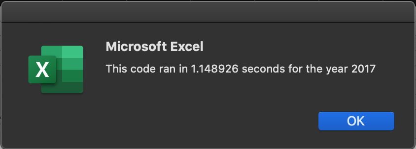
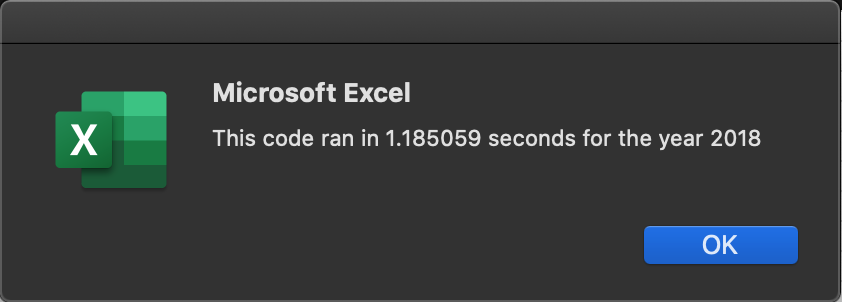
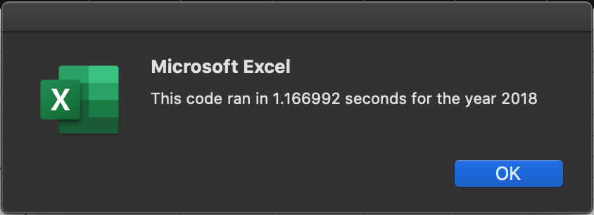
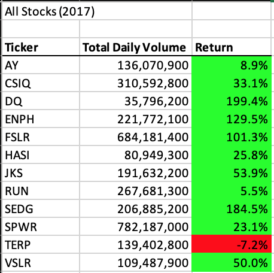
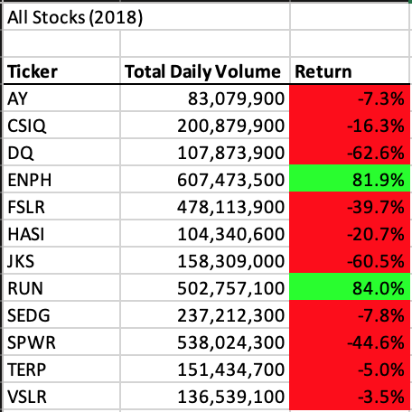

# Stock Anlaysis with VBA

## Overview of Project

### Purpose

The objective of this project was to refactor the original Module 2 stock analysis code in order to improve execution time and readability. We accomplished this by looping through our data and storing the information of interest in arrays as well as leaving comments to help us guide our thought process. Additionally, we timed the speed of the subroutine to execute and used this data as a way to determine the effectiveness of our refactoring.

## Results

### Analysis of Original VBA Script

At first the original VBA Script had a shorter run time, but that was determined to be because the script wasn't formatting the data yet. This was corrected by combining our `Sub formatAllStocksAnalysisTable()` and our `Sub AllStocksAnalysis()`. In Module 2.5.3 we also learned that "subsequent runs of a macro are shorter because computer resources have already been allocated to run the macro." In order to combat this we quit Microsoft Excel and relaunched for each timed run. The results of our timed runs looked reasonable:
 
The biggest difference that was identified was the fact that we were outputting data at the end of analyzing each ticker as seen in the edited code excerpt below:
```
    For i = 0 To 11
        ticker = tickers(i)
        totalVolumeAll = 0
    
        '5. Loop through rows in the data
        Worksheets(yearValue).Activate
        For j = rowStart To rowEnd
        
        ...
        
        Next j
    
        '6. Output the data for the current ticker
        Worksheets("All Stocks Analysis").Activate
        Cells(4 + i, 1).Value = ticker
        Cells(4 + i, 2).Value = totalVolumeAll
        Cells(4 + i, 3).Value = (endingPriceAll / startingPriceAll) - 1
    Next i
```

### Analysis of Refactored VBA Script

In the original code we outputted the data after analyzing it and then recycled the variables within the `For` loop. In our refactored code we created 3 new arrays to store our data in: 
```
    'Create three output arrays to hold values for volumes, starting prices, and ending prices
    Dim tickerVolumes(12) As Long
    Dim tickerStartingPrices(12) As Single
    Dim tickerEndingPrices(12) As Single
```
This allowed us to not only store the data, but also to be able to iterate through it when it came time to display the data:
```
    'Loop through your arrays and pull data to fill worksheet with data for Ticker, Total Daily Volume, and Return.
    For k = 0 To 11
        
        'Activate the worksheet for displaying the data
        Worksheets("All Stocks Analysis").Activate

        Cells(4 + k, 1).Value = tickers(k)
        Cells(4 + k, 2).Value = tickerVolumes(k)
        Cells(4 + k, 3).Value = (tickerEndingPrices(k) / tickerStartingPrices(k)) - 1
        
    Next k
```
To reiterate, when evaluating timed runs we quit Microsoft Excel and relaunched for each time in order to combat the shorter run times encountered on subsequent macro runs when computer resources have already been allocated to running the macro. When we executed the macro, I was surprised to find a noticeable difference in the hundredths of seconds when comparing the run times between the refactored scripts (seen below) and the [original scripts](https://github.com/BLTerrell/stock-analysis/blob/main/README.md#analysis-of-original-vba-script).
 
Another take away was that this was only across 12 stock tickers. I would expect the run time differences to be even more dramatic with a larger quantity of tickers.


### Analysis of stock performance between 2017 and 2018

Our analysis of the stocks indicates that 2017 was a better year for the 12 analyzed stocks because there was a greater count of positive returns (as visualized using cells with green backgrounds) and the returns had larger percentages.

 

More importantly to Steve, "ENPH" and "RUN" look to be strong investment candidates due to their high daily volumes and postive returns for both 2017 and 2018. "ENPH" stocks are a prime target as they had greater than 80% returns in both years. 

## Summary

### Refactoring in General

In general, refactoring is advantageous because you're trying to make your code more efficient by reducing the number of steps and memory needed to run a script. At a minimum it allows the you to become more familiar with the code, and if you are adding comments then that should benefit future reviews. The potential disadvantages are the time commitment required to go through the process as well as not knowing if your time spent will make code executions quicker until the work is actually done. 

### Our Refactored VBA Script

The biggest benefit for refactoring our stock analysis code was that it allowed us to store the data. This would be beneficial if our script expanded in the future and we needed to call these values again. The only noticeable disadvantage to me was the fact that all of us engaging in this challenge followed the same prompt on how to refactor this code. It would be interesting to see the different ways other individuals would approach the challenge and if they could successfully refactor the code to make it more readable and make it execute quicker.